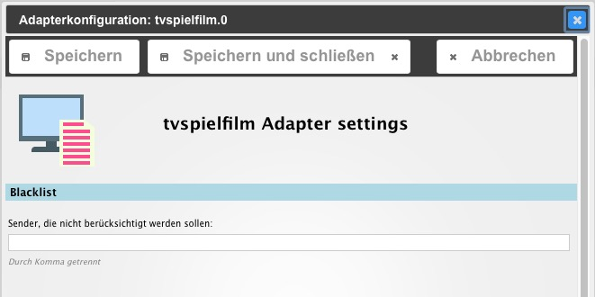

# ioBroker.feiertage
=================

## Beschreibung / Description
Deutsch  | English
------------- | -------------
Dieser Adapter liefert das TV Programm aus den RSS-Feeds "Tipps" und "jetzt" des Anbieters tvspielfilm.de  | This adapter delivers german TV program guide. The content ist captured from two RSS feeds of supplier tvspielfilm.de

## Einstellungen / Configuration
Deutsch  | English
------------- | -------------
Sender, die nicht empfangbar sind, können in der Blacklist gespeichert werden und so bei der Ausgabe übersprungen werden | TV channels that are not provided by your supplier are not considered to be listed. Therefore you can add them to the blacklist.

##  Datenpunkte

tvspielfilm.# __tipps__  (*JSON* Tabelle für VIS Widget *json,table*)

tvspielfilm.# __jetzt__  (*JSON* Tabelle für VIS Widget *json,table*)

##  Datapoints

tvspielfilm.# __tipps__  (*JSON* Tabelle for VIS widget *json,table*)

tvspielfilm.# __jetzt__  (*JSON* Tabelle for VIS widget *json,table*)

# CSS Konfiguration / CSS settings
Deutsch  | English
------------- | -------------
Für eine optisch ansprechende Formatierung, empfehle ich folge CSS Definitionen im VIS Editor zu verwenden | For a nicer look the following CSS is suggested to be copied to the VIS editor.

'''.tclass-th { /* Headerzeilen */
    background-color: darkgrey;
    background-color: rgba(100,100,100,0.8);
    color: white;
    font-weight: bold;
    font-family: Arial;
}

.tclass-th1 { /* linker Header */ 
    width: 20px;
    text-align: center;
    color: transparent; /* Text ausblenden */
    /* display: none; */ /* ganze Spalte ausblenden */
}

.tclass-th .tclass-th1 {
    display: none; /* Spaltenüberschrift überm Bild ausblenden*/
}

.tclass-tr {
    color: red;
}

.tclass-tr:nth-child(odd) {
    background-color: darkgreen;
    background-color: rgba(50,120,80,0.6);
}

.tclass-tr:nth-child(even) {
    color: yellow;
    background-color: darkred;
    background-color: rgba(150,150,150,0.2);
}

.tv_tipps, 
.tv_jetzt {
    font-family: Arial;
    font-size: 75%;
}

.tv_tipps tr, 
.tv_jetzt tr {
    background-color: transparent;
    color: white;
}

.tv_tipps tr td a, 
.tv_jetzt tr td a {
    background-color: transparent;
    color: white;
    text-decoration: none;
}

.tv_jetzt tr td a {
    font-size: 130%;
}
'''

## Aktivierung / Schedule
Deutsch  | English
------------- | -------------
Der Adapter startet alle 5min und liest beide Feeds ("Tipps" und "jetzt") ein | The adapter starts every 5min to read both RSS-Feeds ("Suggestions" and "Now").

## Changelog

### 0.0.1 (2016-05-07)
* (pix) Adapter created

## Todo

* Übersetzungen / Translation
* Programmtipps, die auf eine Uhrzeit hinweisen, die vor der aktuellen Uhrzeit liegt, ausblenden

## License

The MIT License (MIT)

Copyright (c) 2016 pix

Permission is hereby granted, free of charge, to any person obtaining a copy
of this software and associated documentation files (the "Software"), to deal
in the Software without restriction, including without limitation the rights
to use, copy, modify, merge, publish, distribute, sublicense, and/or sell
copies of the Software, and to permit persons to whom the Software is
furnished to do so, subject to the following conditions:

The above copyright notice and this permission notice shall be included in all
copies or substantial portions of the Software.

THE SOFTWARE IS PROVIDED "AS IS", WITHOUT WARRANTY OF ANY KIND, EXPRESS OR
IMPLIED, INCLUDING BUT NOT LIMITED TO THE WARRANTIES OF MERCHANTABILITY,
FITNESS FOR A PARTICULAR PURPOSE AND NONINFRINGEMENT. IN NO EVENT SHALL THE
AUTHORS OR COPYRIGHT HOLDERS BE LIABLE FOR ANY CLAIM, DAMAGES OR OTHER
LIABILITY, WHETHER IN AN ACTION OF CONTRACT, TORT OR OTHERWISE, ARISING FROM,
OUT OF OR IN CONNECTION WITH THE SOFTWARE OR THE USE OR OTHER DEALINGS IN THE
SOFTWARE.

---
*Logo is partly crafted by CHALLENGER*
